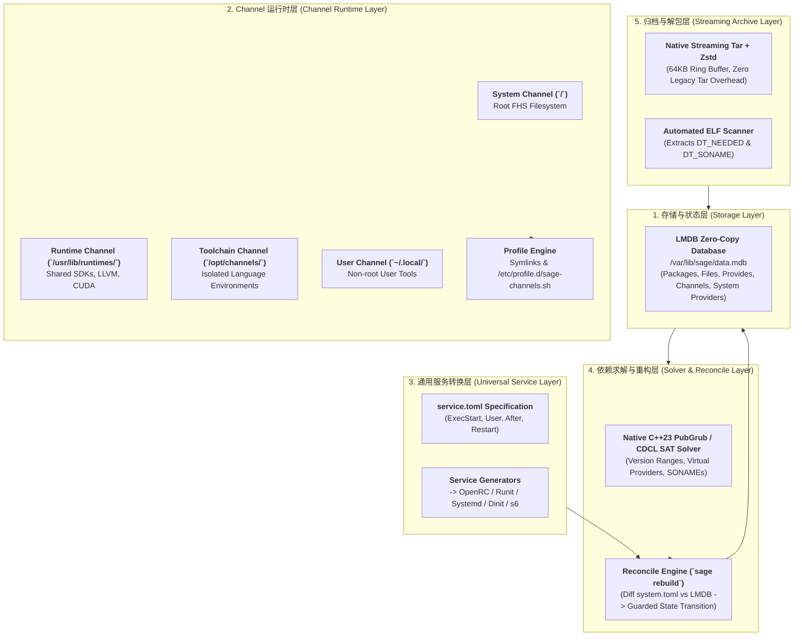

# Sage Architecture Specification
**Version:** 2.0  
**Status:** Approved  
**Language:** Modern C++23 (100% C++23 Modules)  
**Build System:** xmake  

---

## 1. System Architecture Overview

Sage is structured as a layered, modular package manager designed around five core subsystem layers:



---

## 2. LMDB Database Schema

The state database `/var/lib/sage/data.mdb` uses dedicated named databases (tables):

| Table Name (DBI) | Key | Value | Purpose |
| :--- | :--- | :--- | :--- |
| `packages` | `pkg_name` | Serialized Package Metadata | Complete metadata, version, release, channel, license |
| `files` | `rel_path` (e.g. `usr/bin/rg`) | `pkg_name:channel_name` | Instant conflict detection & file ownership lookup |
| `provides` | `symbol` (e.g. `virtual/init`, `so:libzstd.so.1`) | `pkg_name` | Fast symbol & virtual provider reverse lookup |
| `channels` | `channel_name` | Channel Scope, Target Root, Triplet, Priority | Channel registry |
| `system` | `interface` (e.g. `virtual/init`) | Active provider (`openrc`) | Declarative system state lock |

---

## 3. Streaming Tar + Zstd Archive Format (`*.pkg.tar.zst`)

```
pkgname-1.0.0-1-x86_64.pkg.tar.zst
├── .METADATA/
│   ├── manifest.toml     # Package name, version, release, license, provides, dependencies
│   ├── files.idx         # Relative path, size, mode, SHA256
│   ├── triggers.toml     # Initramfs, bootloader, ldconfig hooks
│   └── service.toml      # Universal daemon specification (optional)
└── data/                 # Direct filesystem payload (usr/bin/..., etc/...)
```

Extraction is fail-closed: package paths are normalized and preflighted before
the payload is written, and every parent directory is then opened relative to a
trusted target-root file descriptor with symlink following disabled. Temporary
regular files and their final rename stay relative to that verified directory,
which prevents archive-controlled symlink traversal and pathname replacement.
This is not a filesystem transaction against a privileged process concurrently
moving an already-open target directory.

Install replacement, remove plans, and provider rebuilds revalidate the state
they planned from inside the LMDB write transaction. Existing files may migrate
only from the exact `pkg_name:channel_name` owner recorded by that transaction;
a concurrent package or provider change aborts the stale operation. LMDB state
updates are transactional, but filesystem extraction/removal is not journaled
for rollback if a later step fails.

---

## 4. Multi-Init Service Generation Mapping

| Target Init | Generated Output Path | Generation Format |
| :--- | :--- | :--- |
| **OpenRC** | `/etc/init.d/<name>` | `#!/sbin/openrc-run` shell script |
| **Runit** | `/etc/sv/<name>/run` & `finish` | `#!/bin/sh` runscript with `chpst` |
| **Systemd** | `/usr/lib/systemd/system/<name>.service` | INI unit file (`[Unit]`, `[Service]`, `[Install]`) |
| **Dinit** | `/etc/dinit.d/<name>` | Dinit service definition (`type = process`, `command = ...`) |
| **s6** | `/etc/s6/services/<name>/run` | execlineb script with `s6-setuidgid` |
