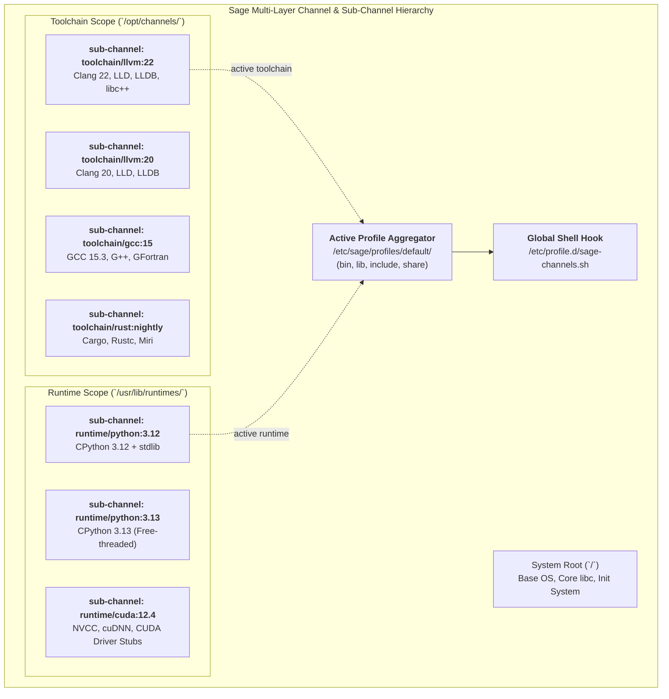

# Sage Next-Step Design: Multi-Toolchain Coexistence & Sub-Channels Architecture

**Document Version:** 1.0  
**Target Milestone:** Sage v0.2.0 - v0.3.0  
**Status:** In-Design & Planned  
**Related Specs:** [ARCHITECTURE.md](ARCHITECTURE.md), [CLI_SPEC.md](CLI_SPEC.md), [MODULES.md](MODULES.md)

---

## 1. Executive Summary & Design Vision

Modern Linux distributions and developer environments face a fundamental friction: **how to maintain multiple, mutually incompatible toolchains (e.g. GCC 13/14/15, LLVM/Clang 18/20/22, Rust stable/nightly, Python 3.10-3.13, CUDA 11/12) on the same host without dependency hell, broken system libraries, or bloated container overlays.**

Traditional approaches suffer from fatal trade-offs:
1. **`update-alternatives` (Debian/RHEL)**: Global symlink hacking prone to partial state corruption and system-wide breakage.
2. **Environment Modules (`lmod` / `modulecmd`)**: Complex TCL/Lua scripting decoupled from package manager state.
3. **Language Version Managers (`rustup`, `pyenv`, `nvm`)**: Scattered across user directories, duplicate binaries, untracked by the package manager, and incapable of managing C/C++ dependencies or shared libraries.

**Sage solves this fundamentally at the package manager architecture level** by combining its **Zero-Copy LMDB State Engine**, **Multi-Layer Channel System**, and a first-class concept of **Sub-Channels (子 Channel)** with **Profile Symlink Aggregation**.



---

## 2. Core Concepts: Channels & Sub-Channels (子 Channel 体系)

### 2.1 Channel Hierarchy & Directory Layout

Sage categorizes software into four orthogonal scopes:

| Scope | Physical Target Root | Purpose | Sub-Channel Pattern |
| :--- | :--- | :--- | :--- |
| `system` | `/` | Minimal Base OS, Core Libc, Init Daemon | N/A (Singular) |
| `runtime` | `/usr/lib/runtimes/<category>/<slot>` | Shared execution runtimes, SDK libraries | `runtime/python:3.12`, `runtime/cuda:12.4` |
| `toolchain` | `/opt/channels/<category>/<slot>` | Compilers, assemblers, linkers, toolchains | `toolchain/llvm:22`, `toolchain/gcc:15` |
| `user` | `~/.local/channels/<name>` | User-scoped developer tools | `user/tools:latest` |

### 2.2 Sub-Channel Syntax & Addressing

A Sub-Channel is addressed through standard Uniform Resource Locators:

$$\text{Canonical Spec} := \langle\text{Scope}\rangle/\langle\text{Category}\rangle:\langle\text{Slot}\rangle$$

Examples:
* `toolchain/llvm:22` $\rightarrow$ Target root: `/opt/channels/llvm/22`
* `toolchain/gcc:15.3` $\rightarrow$ Target root: `/opt/channels/gcc/15.3`
* `toolchain/rust:nightly-2026` $\rightarrow$ Target root: `/opt/channels/rust/nightly-2026`
* `runtime/python:3.12` $\rightarrow$ Target root: `/usr/lib/runtimes/python/3.12`
* `runtime/cuda:12.4` $\rightarrow$ Target root: `/usr/lib/runtimes/cuda/12.4`

### 2.3 Strict Filesystem Isolation

Every sub-channel maintains a complete, self-contained FHS root:
```
/opt/channels/llvm/22/
├── bin/
│   ├── clang -> clang-22
│   ├── clang++ -> clang-22
│   ├── lld
│   └── llvm-config
├── lib/
│   ├── libc++.so.1
│   ├── libc++abi.so.1
│   └── libLLVM-22.so
├── include/
│   └── c++/v1/
└── share/
```
No sub-channel files ever collide directly in `/usr/bin` or `/usr/lib`.

---

## 3. Toolchain System Package Binding & Management

### 3.1 Declarative Channel Binding in Recipes (`recipe.toml`)

Package recipes can explicitly bind their build and runtime requirements to specific toolchain channels:

```toml
[package]
name = "pytorch"
version = "2.4.0"
release = "1"
channel = "runtime/pytorch:2.4"
description = "Tensors and Dynamic neural networks in Python with GPU acceleration"

[build_requirements]
# Declares that this build requires specific compiler and CUDA sub-channels
channels = [
    "toolchain/llvm:22",
    "runtime/cuda:12.4",
    "runtime/python:3.12"
]
system_pkgs = ["cmake >= 3.28", "ninja >= 1.11"]

[dependencies]
# Runtime dependencies bound to specific runtime channels
channels = ["runtime/cuda:12.4", "runtime/python:3.12"]
system_deps = ["virtual/libc", "so:libzstd.so.1"]
```

### 3.2 Dynamic Linker RUNPATH & ABI Isolation

To ensure that binaries compiled with a non-system toolchain always load their correct shared libraries without contaminating `/usr/lib`:
1. **ELF DT_RUNPATH Embedding**: Sage's automated builder stamps `$ORIGIN/../lib` and `/opt/channels/<name>/lib` into dynamic binaries.
2. **SONAME Scoping**: `sage.db` indexes SONAME symbols with their originating channel (`so:libc++.so.1 -> toolchain/llvm:22`), enabling the PubGrub solver to enforce cross-channel ABI compatibility.

---

## 4. Sage Toolchain CLI & Profile Management

Sage introduces dedicated CLI commands to manage, inspect, and switch active toolchains effortlessly.

### 4.1 Installing & Managing Toolchain Channels

```bash
# List all available toolchains across configured remote repositories
sage toolchain list-available

# Install specific toolchain sub-channels
sage toolchain install llvm:22
sage toolchain install gcc:15
sage toolchain install rust:nightly

# List installed toolchain sub-channels on the host
sage toolchain list
```

### 4.2 Switching the Active Host Toolchain Profile

Switching the active compiler for the entire system (or for the current user) is an **atomic $O(1)$ symlink swap**:

```bash
# Switch active compiler profile to Clang 22
sage toolchain use llvm:22

# Switch active compiler profile to GCC 15
sage toolchain use gcc:15
```

**How `sage toolchain use` works internally:**
1. Atomic symlink creation in `/etc/sage/profiles/default/`:
   * `/etc/sage/profiles/default/bin/cc -> /opt/channels/llvm/22/bin/clang`
   * `/etc/sage/profiles/default/bin/c++ -> /opt/channels/llvm/22/bin/clang++`
   * `/etc/sage/profiles/default/bin/clang -> /opt/channels/llvm/22/bin/clang`
2. Updates `/etc/sage/channels.toml` with `active = true`.
3. Broadcasts environment refresh via `/etc/profile.d/sage-channels.sh`.

### 4.3 Ephemeral Toolchain Environments (`sage shell`)

Developers can spawn an isolated, ad-hoc shell with any combination of toolchains and runtimes without modifying host profiles:

```bash
# Launch a subshell with Clang 22, Python 3.12, and CUDA 12.4
sage shell --with toolchain/llvm:22 --with runtime/python:3.12 --with runtime/cuda:12.4

# Verify inside subshell:
$ which clang    # -> /opt/channels/llvm/22/bin/clang
$ which python3  # -> /usr/lib/runtimes/python/3.12/bin/python3
$ nvcc --version # -> 12.4
```

---

## 5. Configuration Specification: `/etc/sage/channels.toml`

The declarative channel configuration format supports hierarchical sub-channels and default slot selections:

```toml
# /etc/sage/channels.toml - Sage Multi-Layer Channel Configuration

[channels.core]
url = "https://pkg.sage-linux.org/core"
scope = "system"
priority = 100
enabled = true

[[channels.toolchains]]
category = "llvm"
slot = "22"
url = "https://pkg.sage-linux.org/toolchains/llvm-22"
target_root = "/opt/channels/llvm/22"
active = true
priority = 80

[[channels.toolchains]]
category = "gcc"
slot = "15"
url = "https://pkg.sage-linux.org/toolchains/gcc-15"
target_root = "/opt/channels/gcc/15"
active = false
priority = 70

[[channels.runtimes]]
category = "python"
slot = "3.12"
url = "https://pkg.sage-linux.org/runtimes/python-3.12"
target_root = "/usr/lib/runtimes/python/3.12"
active = true
priority = 90
```

---

## 6. Implementation Roadmap

### Phase 1: Sub-Channel Schema & LMDB State Integration (Milestone v0.2.0)
- [ ] Extend `sage::channel::Channel` struct to parse `<Scope>/<Category>:<Slot>` specs.
- [ ] Add sub-channel metadata indexing to `channels` DBI table in `sage.db`.
- [ ] Update `ProfileManager` to support granular category slot resolution.

### Phase 2: `sage toolchain` CLI Subcommands (Milestone v0.2.1)
- [ ] Implement `sage toolchain [list|install|remove|use|pin]`.
- [ ] Implement atomic profile slot swapper (`/etc/sage/profiles/<profile_name>/`).
- [ ] Provide backward-compatible wrappers for `cc`, `c++`, `ld`, `as`.

### Phase 3: Ephemeral Subshell Environment (`sage shell`) (Milestone v0.2.2)
- [ ] Implement `sage shell --with <sub-channel...>` process launcher.
- [ ] Auto-inject `PATH`, `LD_LIBRARY_PATH`, `CPATH`, `PKG_CONFIG_PATH`, `CC`, `CXX`, `AR`, `RANLIB`.

### Phase 4: Sandboxed Channel Package Building (Milestone v0.3.0)
- [ ] Utilize Linux `unshare` mount namespaces to bind only requested toolchain sub-channels into the build environment.
- [ ] Generate reproducible, multi-toolchain build manifests.
